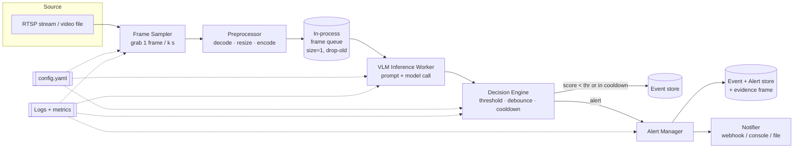
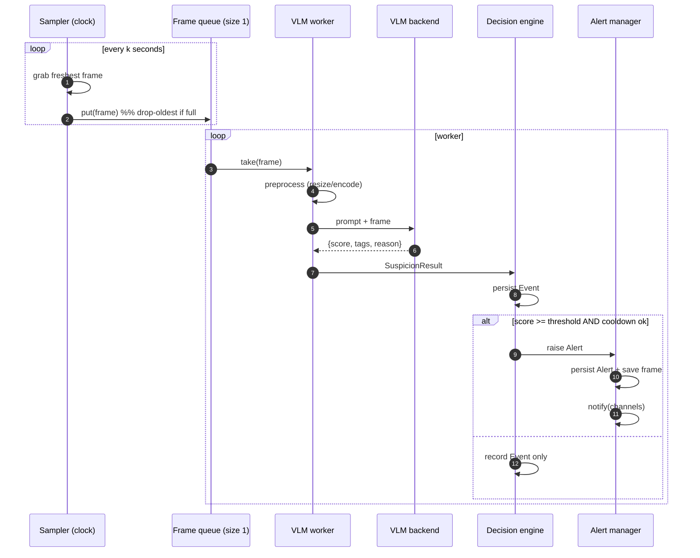

# Argus — System Design v0: Single-Camera Footage Analysis Service

> **Status:** Draft v0 · Design proposal (not yet implemented)
> **Last updated:** 2026-07-28
> **Owner:** @mayuresh714
> **Prereq reading:** [`00-problem-and-scope.md`](./00-problem-and-scope.md)

This document specifies the **first buildable milestone** of Argus: a single
service that watches **one** camera, samples a frame every _k_ seconds, asks an
open-source VLM whether the scene looks suspicious, and raises a debounced alert
when it does.

The guiding principle for v0 is **prove the loop, not the numbers**. We want an
end-to-end pipeline that is correct, observable, and easy to tune — accuracy
optimisation is Phase 2.

---

## 1. Scope of v0

**In scope**
- One input source: an RTSP stream **or** a local video file (for testing).
- Frame sampling on a fixed _k_-second cadence.
- A single VLM inference step per sampled frame (the "unit of analysis").
- Structured suspicion output: `score`, `reason`, `tags`.
- Threshold + debounce/cooldown decision logic.
- Alert emission: structured log + one pluggable notifier (e.g. webhook/console).
- Persistence of events and the evidence frame for each alert.
- File-based config; basic metrics/logs.

**Out of scope for v0** (see roadmap in `00`)
- Multiple cameras, worker pools, dashboards.
- Temporal/short-clip analysis (v0 = single frame; interface designed to allow
  swapping later).
- Face recognition / re-identification / tracking.
- Fine-tuning; hybrid detector gating.
- HA, clustering, auth, multi-tenant concerns.

---

## 2. Requirements

### 2.1 Functional
- **F1** Connect to one RTSP URL or open one video file.
- **F2** Every _k_ seconds, grab the current/next frame.
- **F3** Preprocess the frame (decode, resize, encode) for the VLM.
- **F4** Query a configured open-source VLM with a fixed suspicion prompt.
- **F5** Parse a structured result `{score ∈ [0,1], reason, tags[]}`.
- **F6** Persist every scored observation as an **Event**.
- **F7** If `score ≥ threshold` **and** cooldown allows, raise an **Alert**
  (persist + notify) with the evidence frame.
- **F8** Everything driven by a single config file; runnable as one process.

### 2.2 Non-functional
- **N1 — Latency:** end-to-end (frame grab → alert) within a few × the VLM call
  time; tens of seconds acceptable for v0.
- **N2 — Resilience:** a dropped stream, a slow VLM call, or a malformed model
  response must not crash the service — log, skip, continue.
- **N3 — Observability:** structured logs + counters (frames sampled, VLM
  latency, events, alerts, errors).
- **N4 — Tunability:** `k`, `threshold`, `cooldown`, model name, and prompt are
  config, not code.
- **N5 — Cost-awareness:** never more than one VLM call per _k_ seconds; sampled
  frames/clips retained per a configurable, default-short policy.
- **N6 — Portability:** runs on one machine with one GPU (or against a local
  model server); no cloud dependency required to function.

---

## 3. High-level architecture

A single process built as a small pipeline of components connected by an
in-process queue. One thread pulls frames on a clock; a worker consumes them,
calls the VLM, decides, and alerts.



**Design choices worth calling out:**
- **Bounded, drop-oldest queue (size 1).** If the VLM is slower than _k_, we do
  **not** build a backlog — we always analyse the *freshest* frame and drop
  stale ones. Argus is about *now*, not about processing every historical frame.
- **Sampler decoupled from worker.** The clock keeps ticking even while a VLM
  call is in flight, so a slow model degrades to "we skip some samples" rather
  than "the whole pipeline stalls."
- **Single unit-of-analysis interface.** The worker consumes an "analysis unit"
  (v0: one frame). Swapping to short clips / frame-stacks later is an
  implementation change behind the same interface.

---

## 4. Component breakdown

### 4.1 Frame Sampler (ingest)
- Opens the source (RTSP via OpenCV/FFmpeg, or a file).
- Runs a clock: every _k_ seconds, grab the latest decoded frame.
- For live RTSP, continuously reads to stay current (so the sampled frame is
  *fresh*, not a decode backlog); for a file, seeks/steps forward by _k_
  seconds of playback time.
- On stream failure: exponential-backoff reconnect (2s→4s→8s→16s…), logging
  each attempt; never crash the process.
- Pushes an `AnalysisUnit` onto the drop-oldest queue.

### 4.2 Preprocessor
- Decodes to RGB, resizes to the VLM's expected input (e.g. long side ~768–1024
  px — enough detail for behaviour, small enough to keep the model fast).
- Optional: timestamp/camera-id overlay for evidence provenance.
- Encodes (JPEG/base64 or tensor) per the inference backend's contract.

### 4.3 VLM Inference Worker
- Consumes one `AnalysisUnit` at a time (v0 is single-concurrency: one VLM call
  in flight).
- Builds the request from the **fixed suspicion prompt** (§6) + the frame.
- Calls the model via a **pluggable backend** (§7): a local server
  (vLLM / Ollama / llama.cpp / TGI) exposing an OpenAI-compatible vision
  endpoint, or a direct in-process transformers load.
- Enforces a **timeout**; on timeout/error, logs and emits a null result
  (no event), never blocks the sampler.
- Parses the model's JSON into a `SuspicionResult`; on unparseable output,
  attempt a lenient extract, else record a `parse_error` event.

### 4.4 Decision Engine
- Applies `score ≥ threshold`.
- **Debounce / cooldown:** after firing an alert, suppress new alerts for
  `cooldown` seconds (or until score drops below a lower `clear_threshold` —
  simple hysteresis) so one real incident ≠ a storm of alerts.
- Optional **consecutive-N**: require *N* consecutive over-threshold samples
  before alerting, to trade a little latency for far fewer one-off false
  positives (config-gated, default N=1 in v0 to keep it simple).
- Every observation → an **Event**; qualifying ones → an **Alert**.

### 4.5 Alert Manager + Notifier
- Persists the Alert with its evidence frame path and the model's reason.
- Dispatches through a **Notifier interface** with pluggable sinks:
  console/log (default), file, webhook/HTTP (for phone push via a downstream
  service). Notifier failures are logged and retried a bounded number of times;
  they never block the pipeline.

### 4.6 Storage
- **v0 keeps it boring:** SQLite for Events/Alerts + a local `evidence/` folder
  for JPEGs. This is enough for one camera and trivially inspectable.
- Retention job (or startup sweep) prunes evidence/events older than
  `retention_days` (default short, per §10 of the foundation doc).

### 4.7 Config
- One `config.yaml`: source URL, `k`, model/backend settings, `threshold`,
  `clear_threshold`, `cooldown`, `consecutive_n`, notifier settings, storage
  paths, `retention_days`, log level.

---

## 5. Data model (v0)

```jsonc
// Event — every scored observation
{
  "id": "uuid",
  "camera_id": "cam-01",
  "ts": "2026-07-28T14:03:11Z",   // when the frame was sampled
  "score": 0.82,                   // VLM suspicion score in [0,1]
  "tags": ["concealment", "exit-without-payment"],
  "reason": "Person placed an item into their jacket and moved toward the exit past the till.",
  "model": "qwen3-vl-8b-instruct",
  "vlm_latency_ms": 640,
  "frame_path": "evidence/cam-01/2026-07-28T14-03-11.jpg",
  "became_alert": true,
  "raw_model_output": "…"          // kept for debugging/calibration
}

// Alert — an Event that crossed threshold and passed debounce
{
  "id": "uuid",
  "event_id": "uuid",              // FK to the triggering Event
  "camera_id": "cam-01",
  "ts": "2026-07-28T14:03:11Z",
  "score": 0.82,
  "reason": "…",
  "frame_path": "evidence/cam-01/2026-07-28T14-03-11.jpg",
  "notified": true,
  "notify_channels": ["console", "webhook"]
}
```

---

## 6. VLM prompt design

The prompt is the heart of v0 and lives in config so we can iterate without a
redeploy. It must force **structured, parseable, calibrated** output and steer
the model toward *behaviour-based* judgement.

**System/instruction (sketch):**

```text
You are a security-monitoring assistant reviewing a single still frame from a
fixed CCTV camera in a <retail store / warehouse / etc.>. Judge ONLY the
behaviour visible in this frame. Do NOT identify or describe individuals'
personal characteristics.

Rate how suspicious the scene is on a scale from 0.0 (clearly normal) to 1.0
(clearly theft or a serious security concern). Common suspicious cues:
concealing merchandise on the body/bag, tampering with tags/packaging,
reaching into a till/restricted area, forcing a door, or leaving past the
point of payment while concealing an item. Ordinary shopping, browsing,
staff activity, and empty scenes are NOT suspicious.

If the frame is ambiguous, prefer a MODERATE score and say why — do not invent
certainty.

Respond with ONLY this JSON, nothing else:
{"score": <float 0..1>, "tags": [<short strings>], "reason": "<one sentence>"}
```

**Notes**
- **Single frame in v0** is a known limitation (theft is temporal). The prompt
  and the `AnalysisUnit` interface are written so a short clip / frame-stack can
  be dropped in for Phase 2 with a prompt tweak ("across these frames…").
- We log `raw_model_output` to catch drift and calibrate thresholds against
  real distributions.
- Anti-bias instruction ("judge only behaviour, do not describe personal
  characteristics") is intentional per the foundation doc's ethics section.

---

## 7. Technology choices (v0)

Chosen for "boring, runnable on one box, swappable":

| Concern | v0 choice | Why / alternatives |
|---|---|---|
| Language | **Python** | Best CV/ML ecosystem; matches repo's `tech-journey` lineage. |
| Video I/O | **OpenCV + FFmpeg** | Standard RTSP/file decode. |
| VLM (candidates) | **Qwen3-VL (8B-class), InternVL3, Gemma-multimodal** | Strong open VLMs; start small/quantised, benchmark 2–3 (Q3 in `00`). |
| Inference backend | **Local server: vLLM / Ollama / llama.cpp**, OpenAI-compatible vision API | Decouples model from app; also allows a hosted VLM during prototyping. |
| Backend abstraction | **`VlmBackend` interface** | Swap local/hosted/model without touching pipeline. |
| Storage | **SQLite + local files** | Zero-ops for one camera; migrate to Postgres/object store at scale. |
| Config | **YAML** | Human-editable, tunable knobs. |
| Notify | **Notifier interface** (console/file/webhook) | Phone push handled by a downstream service later. |
| Packaging | **Single process + Dockerfile** | One command to run; GPU passthrough for local model. |

> These are defaults, not commitments. The interfaces (`VlmBackend`, `Notifier`,
> `AnalysisUnit`) are the real contract; concrete tools can change.

---

## 8. Key runtime flows

### 8.1 The k-second sampling loop (happy path)



### 8.2 Failure handling (must-not-crash paths)
- **Stream drops** → sampler backs off and reconnects; worker idles.
- **VLM timeout/error** → worker logs, emits no event for that tick, continues.
- **Unparseable model output** → lenient parse → else `parse_error` event, no
  alert.
- **Notifier failure** → bounded retry, then log-and-drop; pipeline unaffected.
- **VLM slower than _k_** → drop-oldest queue means we skip stale frames and
  always analyse the latest; we log a `frames_dropped` counter.

---

## 9. Observability

- **Structured logs** (JSON) per stage with correlation on `event_id`.
- **Counters/metrics:** `frames_sampled`, `frames_dropped`, `vlm_calls`,
  `vlm_errors`, `vlm_latency_ms` (histogram), `events`, `alerts`,
  `notify_failures`.
- **Health:** last-successful-frame timestamp (detects a silently dead stream);
  rolling VLM latency (detects a degrading model backend).
- v0 exposes these via logs + an optional `/healthz` + `/metrics` if we add a
  tiny HTTP surface; a dashboard is Phase 3.

---

## 10. Performance & cost envelope (rough, to be measured)

Illustrative, **to validate empirically** (Q1/Q3 in `00`):

- One camera at `k = 5 s` → **~12 VLM calls/minute**, ~720/hour.
- An 8B-class quantised VLM on a single modern GPU: order **~0.3–1.5 s/frame**
  → comfortably keeps up at `k ≥ 2–3 s`; drop-oldest covers spikes.
- Storage: one JPEG per alert (+ optionally per event) — megabytes/day at these
  rates; retention keeps it bounded.

These are targets to confirm on real hardware, not guarantees.

---

## 11. Testing strategy (v0)

- **Unit:** decision-engine threshold/debounce/hysteresis; result parser
  (incl. malformed JSON); config loading.
- **Component:** feed a **recorded video file** (a `file://` source) with known
  "theft" and "normal" segments; assert alerts fire on the former and not the
  latter — this is the primary v0 acceptance test and needs no live camera.
- **Model bake-off harness:** run the same clips through 2–3 candidate VLMs and
  compare precision/false-alarms/latency (feeds the model-choice decision).
- **Resilience:** simulate stream drop, VLM timeout, bad JSON — assert the
  process stays up and metrics reflect the fault.
- **Datasets:** staged clips + public shoplifting/anomaly footage
  (DCSASS / UCF-Crime-style) for a first precision/recall read.

---

## 12. What v0 deliberately leaves for later

| Deferred | Phase | Why not in v0 |
|---|---|---|
| Multiple cameras + worker pool | 3 | Prove one camera first; scaling is a known pattern. |
| Temporal/short-clip analysis | 2 | Single frame is simpler; interface already allows the swap. |
| Motion-gated bursty sampling (skip empty scenes) | 2 | Big cost win, but an optimisation on top of a working loop. |
| Hybrid cheap-detector gate → VLM | 4 | Optimisation; needs a baseline to beat. |
| Fine-tuning | 4 | Start zero-shot; only invest if numbers demand it. |
| Dashboard / auth / multi-tenant | 3 | Not needed to validate the core hypothesis. |

---

## 13. Open questions carried from foundation

- **Q1** Best default `k`? → measure in the component test harness.
- **Q2** Single frame vs short clip vs frame-stack as the unit of analysis? →
  the `AnalysisUnit` interface is built to test all three.
- **Q3** Which open VLM is the cost/accuracy sweet spot? → bake-off in §11.
- **Q5** Does single-frame input miss too much temporal context to be useful? →
  the first thing the component tests will tell us; likely the trigger to pull
  Phase-2 short-clip work forward.

---

*This is a design proposal for review, not yet an implementation. Once agreed,
the next step is a minimal skeleton: config → file-source sampler → mock VLM
backend → decision engine → console notifier, then swap the mock for a real
open VLM.*
